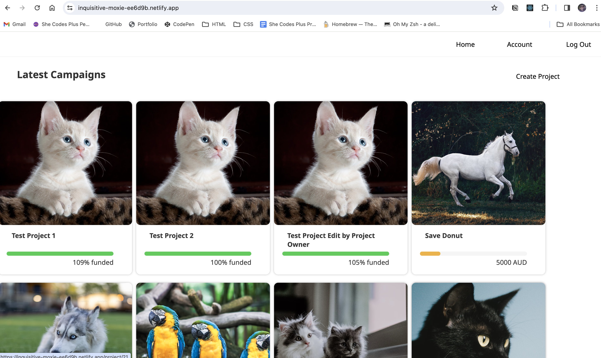
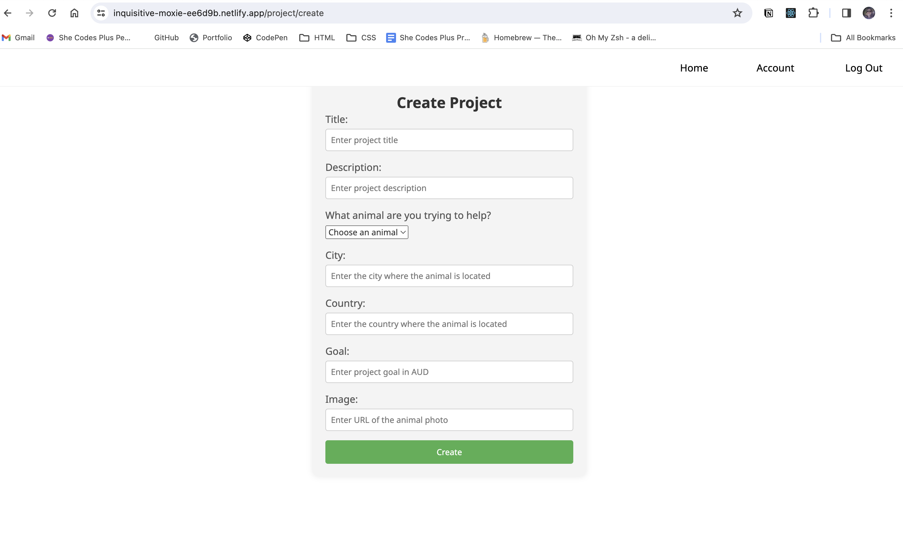
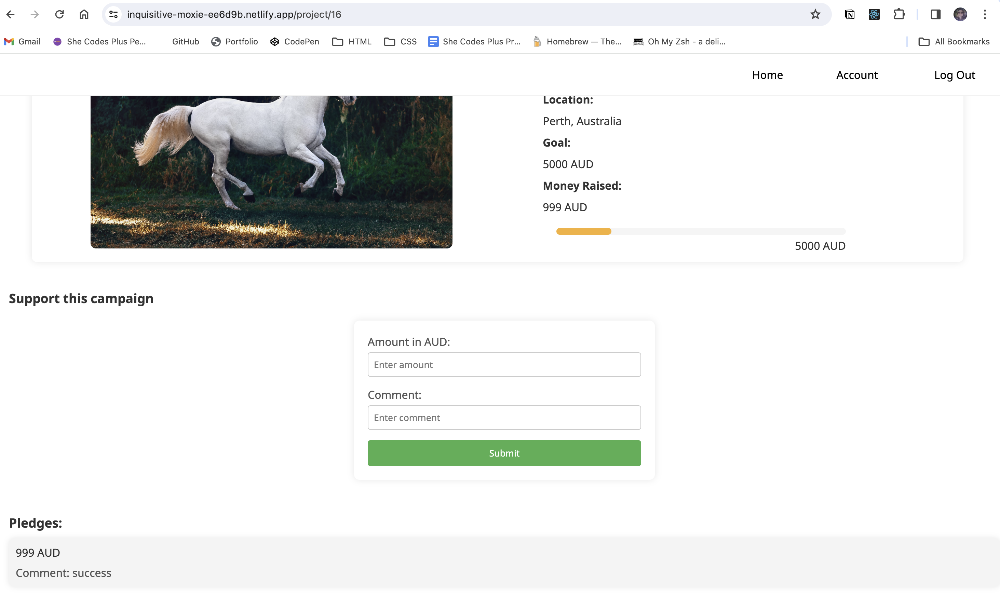
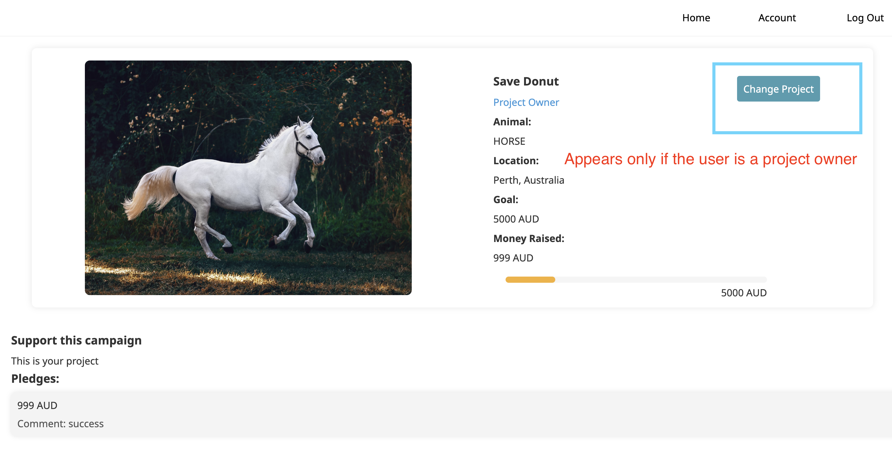
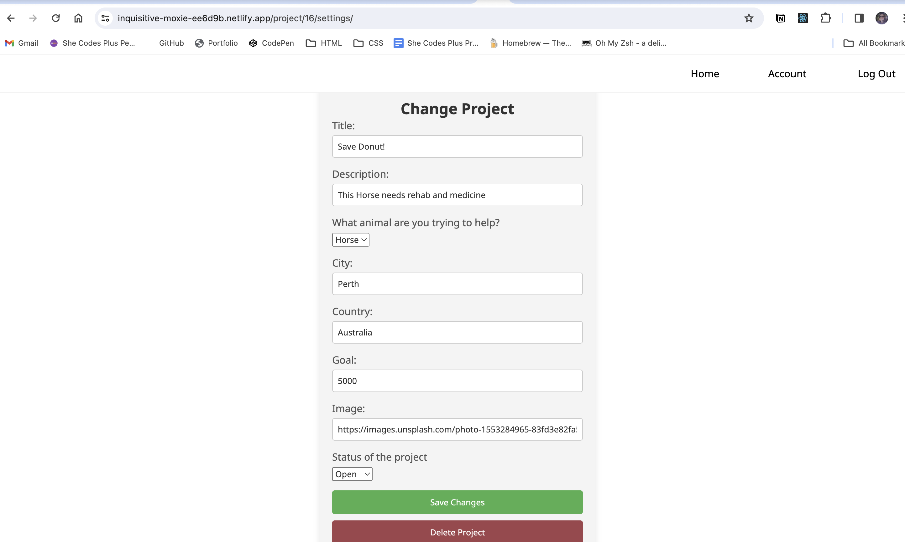

# crowdfunding_front_end

# Crowdfunding Front End
Anya Belkina
https://inquisitive-moxie-ee6d9b.netlify.app/

## Planning:
### Concept/Name
This is an animal fundraising web-site. Join our community to support various animal welfare projects, create personalized campaigns, and make a real impact on the lives of animals in need. Together, let's create a world where every paw lives the best lives and finds a loving home.
### Intended Audience/User Stories
For people who want to raise money to support animals. They can create a campaigne to raise money for medical bills, homestay or food. People from all over the world can donate money to help the little furry friends. You can also search all the animals that are located in a specific city.

  
### screenshot of the homepage

| | | | | | |
### screenshot of the project creation page

### Gscreenshot of a project with pledges

### screenshot of the resulting page when an unauthorized user attempts to edita project (optional, depending on whether or not this functionality makes sense inyour app!)

### Planned improvements
- {{ Responsive Design }}
- {{ Filtering by animal category }}
- {{ Filtering by location }}
- {{ Filtering by whether the project is active/ successful }}
- {{ error messages when complete forms }}